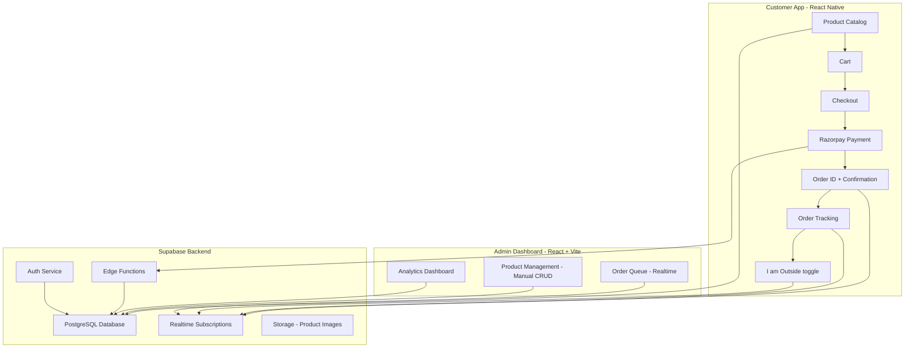
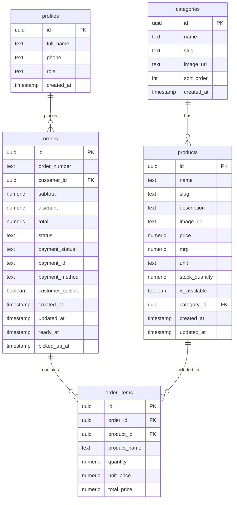
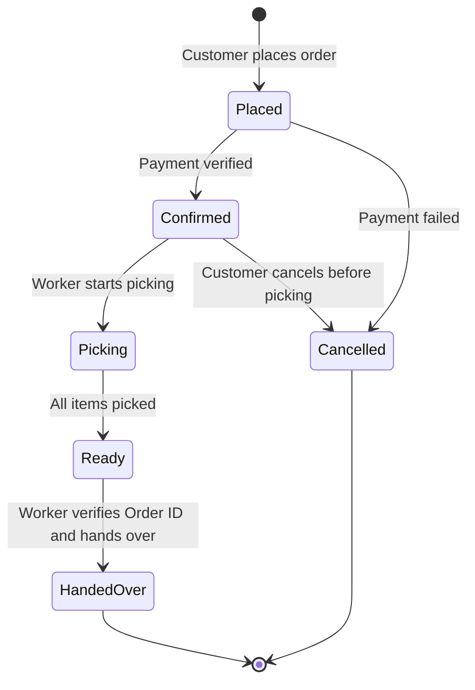
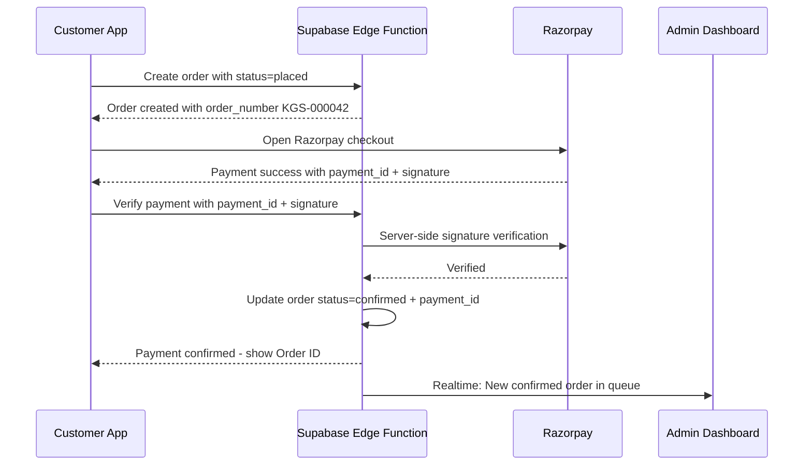
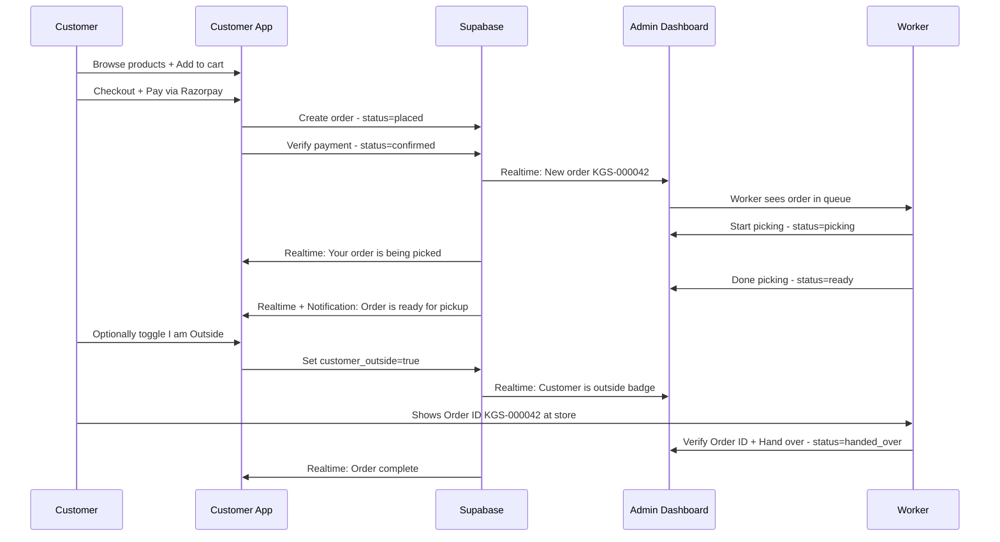

# 🏪 Korde Grocery Store — E-Commerce Platform Architecture Plan

## 1. Project Overview

Transform the current in-store ordering process into a digital pickup-order system where customers can browse 1500+ products, place orders, pay online via Razorpay, and pick up at the store when ready.

### Current Flow
Customer arrives → Order taken on Tally/paper → Payment by cash/UPI → Workers pick items (~10-15 min) → Customer waits outside → Worker hands over items

### New Flow
Customer opens app → Browses/searches products → Adds to cart → Pays via Razorpay → Receives Order ID → Workers see order on dashboard → Pick items → Mark as Ready → Customer gets notification → Customer shows Order ID at store → Worker verifies and hands over items

---

## 2. System Architecture



---

## 3. Database Schema



### Order Status Flow



### Status Values

| Status | Description | Who Sees |
|--------|-------------|----------|
| `placed` | Order placed, awaiting payment confirmation | Customer, Admin |
| `confirmed` | Payment verified, order in queue | Customer, Admin |
| `picking` | Worker is collecting items | Customer, Admin |
| `ready` | Items picked, ready for pickup | Customer, Admin |
| `handed_over` | Customer received items | Customer, Admin |
| `cancelled` | Order cancelled | Customer, Admin |

---

## 4. User Roles

| Role | Access | Auth Method |
|------|--------|-------------|
| `customer` | Browse products, place orders, track orders, toggle I am Outside | Phone OTP |
| `admin` | Full access: manage products, view/process orders, analytics | Email + Password |

> **Note:** Single admin account shared by all workers. No separate staff accounts or role management needed.

---

## 5. Key Features

### 5.1 Customer App - React Native

#### Product Browsing
- Category-wise product listing with product count per category
- Search by product name with debounce
- Filter by availability
- Product detail page with image, price, MRP, unit, stock status

#### Cart and Checkout
- Add/remove items, adjust quantities
- Cart persists locally via AsyncStorage + Zustand persist
- Checkout summary: subtotal, discount, total
- Pickup only — no delivery address needed
- Optional toggle: I am outside the store right now

#### Razorpay Payment
- UPI, cards, wallets supported via Razorpay SDK
- Payment verified server-side via Edge Function
- On failure: order marked cancelled, retry option given
- On success: Order ID displayed prominently like KGS-000042

#### Order Tracking
- Real-time order status via Supabase Realtime subscription
- Visual timeline: Placed → Confirmed → Picking → Ready → Handed Over
- Push notification when order becomes Ready
- Order ID displayed large for easy show-and-tell at store

#### I am Outside Feature
- Toggle button available once order is confirmed or later
- Sets `customer_outside = true` on the order
- Shows on admin dashboard as a badge/alert on the order card
- Can be toggled off if customer steps away

### 5.2 Admin Dashboard - React + Vite

#### Order Management
- Real-time order queue — new orders appear instantly with sound alert
- Order cards show: Order ID, customer name, items count, total, status, customer_outside badge
- Click order to expand: full item list with quantities
- Status action buttons: Confirm → Start Picking → Mark Ready → Hand Over
- Search/filter by Order ID, status, date
- Customer Outside indicator highlighted in orange/yellow

#### Product Management
- Full CRUD for products and categories
- Manual product entry form: name, category, price, MRP, unit, stock, image
- Bulk toggle availability on/off
- Product image upload to Supabase Storage
- Search and filter products table

#### Analytics
- Daily/weekly/monthly revenue
- Total orders count and average order value
- Top-selling products list
- Order status distribution pie chart
- Charts via Recharts

---

## 6. API Design - Supabase

### Tables and RLS Policies

| Table | Customer | Admin |
|-------|----------|-------|
| `categories` | READ | READ, WRITE |
| `products` | READ available only | READ, WRITE all |
| `orders` | READ WRITE own only | READ WRITE all |
| `order_items` | READ own only | READ all |
| `profiles` | READ own only | READ all |

### Edge Functions

| Function | Purpose |
|----------|---------|
| `verify-payment` | Verify Razorpay payment signature server-side |
| `generate-order-number` | Create unique order number like KGS-000001 |

### Realtime Channels

| Channel | Subscribers | Events |
|---------|-------------|--------|
| `orders` | Admin Dashboard | New order, status change, customer_outside toggle |
| `order:{id}` | Customer who placed order | Status change |

---

## 7. Project Structure

```
kordeproject/
├── apps/
│   ├── customer-app/          # React Native - Expo
│   │   ├── src/
│   │   │   ├── screens/
│   │   │   │   ├── HomeScreen.tsx
│   │   │   │   ├── CategoryScreen.tsx
│   │   │   │   ├── ProductScreen.tsx
│   │   │   │   ├── SearchScreen.tsx
│   │   │   │   ├── CartScreen.tsx
│   │   │   │   ├── CheckoutScreen.tsx
│   │   │   │   ├── OrderTrackingScreen.tsx
│   │   │   │   ├── OrderHistoryScreen.tsx
│   │   │   │   └── ProfileScreen.tsx
│   │   │   ├── components/
│   │   │   │   ├── ProductCard.tsx
│   │   │   │   ├── CartItem.tsx
│   │   │   │   ├── SearchBar.tsx
│   │   │   │   ├── OrderStatusTimeline.tsx
│   │   │   │   ├── ImOutsideToggle.tsx
│   │   │   │   └── OrderIdBadge.tsx
│   │   │   ├── stores/
│   │   │   │   ├── authStore.ts
│   │   │   │   ├── cartStore.ts
│   │   │   │   └── orderStore.ts
│   │   │   ├── services/
│   │   │   │   ├── supabase.ts
│   │   │   │   └── razorpay.ts
│   │   │   ├── navigation/
│   │   │   │   └── AppNavigator.tsx
│   │   │   └── utils/
│   │   │       └── helpers.ts
│   │   ├── app.json
│   │   ├── package.json
│   │   └── tsconfig.json
│   │
│   └── admin-dashboard/       # React + Vite
│       ├── src/
│       │   ├── pages/
│       │   │   ├── OrdersPage.tsx
│       │   │   ├── ProductsPage.tsx
│       │   │   └── AnalyticsPage.tsx
│       │   ├── components/
│       │   │   ├── OrderCard.tsx
│       │   │   ├── OrderDetailModal.tsx
│       │   │   ├── CustomerOutsideBadge.tsx
│       │   │   ├── ProductTable.tsx
│       │   │   ├── ProductFormModal.tsx
│       │   │   └── charts/
│       │   │       ├── RevenueChart.tsx
│       │   │       └── TopProductsChart.tsx
│       │   ├── stores/
│       │   │   ├── authStore.ts
│       │   │   ├── orderStore.ts
│       │   │   └── productStore.ts
│       │   ├── services/
│       │   │   └── supabase.ts
│       │   └── utils/
│       │       └── helpers.ts
│       ├── index.html
│       ├── package.json
│       ├── vite.config.ts
│       └── tsconfig.json
│
├── supabase/
│   ├── config.toml
│   ├── migrations/
│   │   ├── 001_create_categories.sql
│   │   ├── 002_create_products.sql
│   │   ├── 003_create_profiles.sql
│   │   ├── 004_create_orders.sql
│   │   ├── 005_create_order_items.sql
│   │   ├── 006_rls_policies.sql
│   │   └── 007_seed_data.sql
│   └── functions/
│       ├── verify-payment/
│       │   └── index.ts
│       └── generate-order-number/
│           └── index.ts
│
├── shared/
│   └── types/
│       ├── product.ts
│       ├── order.ts
│       └── user.ts
│
├── package.json
└── README.md
```

---

## 8. Authentication Flow

### Customer App — Phone OTP
1. Enter phone number
2. Supabase Auth sends OTP via SMS
3. Enter OTP to verify
4. On first login: collect name
5. Profile created in `profiles` table with role=customer
6. JWT stored securely on device

### Admin Dashboard — Email + Password
1. Single pre-created admin account
2. Email + password login via Supabase Auth
3. Profile in `profiles` table with role=admin
4. Session managed with auto-refresh token

---

## 9. Payment Flow



---

## 10. Order Lifecycle Flow



---

## 11. Implementation Phases

### Phase 1: Foundation
1. Initialize monorepo with pnpm workspaces
2. Set up Supabase project with all migrations
3. Configure Supabase Auth - phone OTP for customers, email/password for admin
4. Set up RLS policies
5. Seed admin account and sample categories

### Phase 2: Customer App
6. Set up React Native Expo project with navigation and theme
7. Build auth flow - phone OTP login
8. Build Home screen with categories and featured products
9. Build Category screen with product grid
10. Build Search with debounced query
11. Build Product detail screen
12. Build Cart with Zustand + AsyncStorage persist
13. Build Checkout + Razorpay payment integration
14. Build Order tracking with realtime status timeline
15. Build Order history screen
16. Build I am Outside toggle
17. Build push notifications

### Phase 3: Admin Dashboard
18. Set up React + Vite project with ShadCN + Tailwind
19. Build admin login page
20. Build Orders page with realtime order queue and sound alert
21. Build Order detail modal with status actions
22. Build Customer Outside badge indicator
23. Build Products page with CRUD table
24. Build Product form modal with image upload
25. Build Analytics page with charts

### Phase 4: Polish and Deploy
26. Error handling and loading states
27. Empty states and edge cases
28. Testing across devices
29. Deploy admin dashboard to Vercel/Netlify
30. Build and publish customer app to Play Store / App Store

---

## 12. Environment Variables

### Customer App (.env)
```
SUPABASE_URL=https://xxx.supabase.co
SUPABASE_ANON_KEY=eyJxxx
RAZORPAY_KEY_ID=rzp_live_xxx
```

### Admin Dashboard (.env)
```
VITE_SUPABASE_URL=https://xxx.supabase.co
VITE_SUPABASE_ANON_KEY=eyJxxx
```

### Supabase Edge Functions secrets
```
RAZORPAY_KEY_ID=rzp_live_xxx
RAZORPAY_KEY_SECRET=xxx
```

---

## 13. Key Technical Decisions

| Decision | Choice | Reason |
|----------|--------|--------|
| Monorepo | pnpm workspaces | Shared types, single repo, simpler management |
| Customer App | Expo managed | Faster dev, OTA updates, easy build |
| State Management | Zustand | Lightweight, simple API, works great with RN |
| UI Library - Mobile | React Native Paper | Material Design, well-maintained, good components |
| UI Library - Web | ShadCN + Tailwind | Modern, customizable, clean dashboards |
| Payment | Razorpay | Standard for India, UPI support, reliable SDK |
| Backend | Supabase | All-in-one: DB, Auth, Realtime, Storage, Edge Functions |
| Realtime | Supabase Realtime | Built-in, no extra infra needed |
| Image Storage | Supabase Storage | Integrated with DB and RLS |
| Charts | Recharts | Simple, React-native, good for dashboards |
